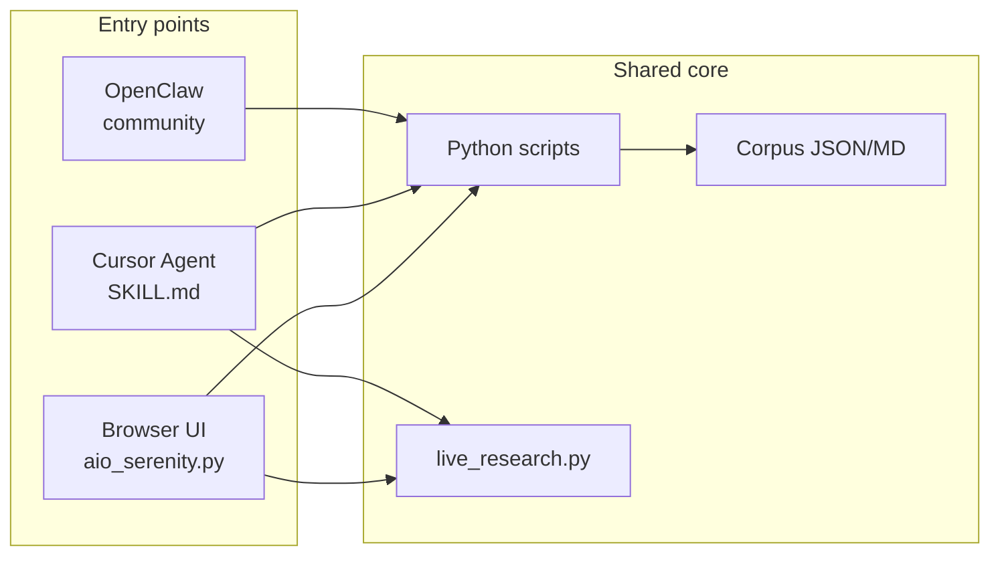
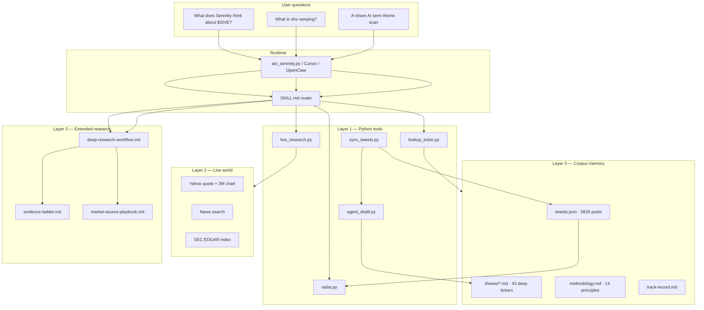
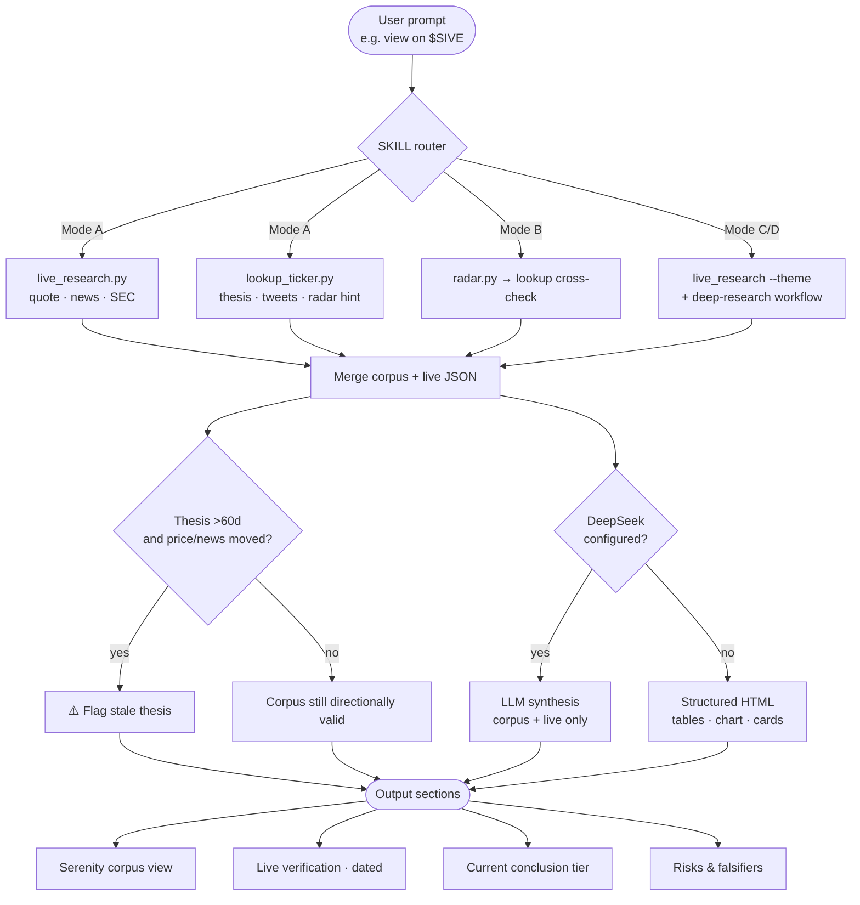
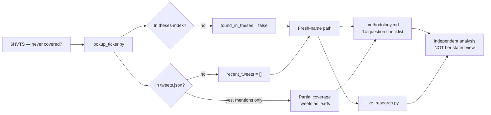
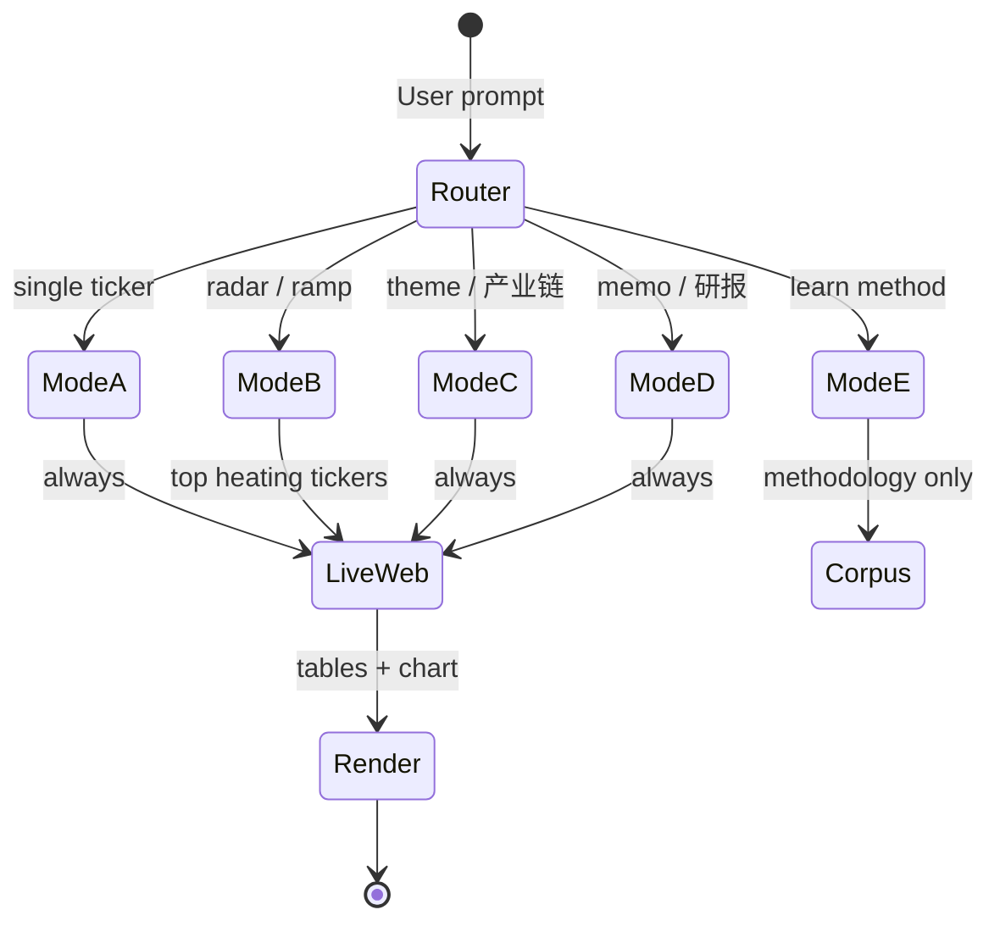
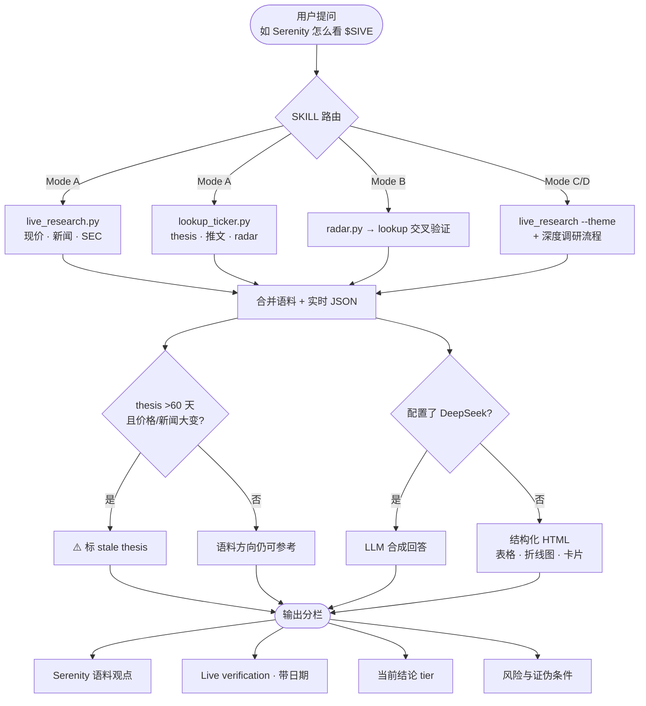
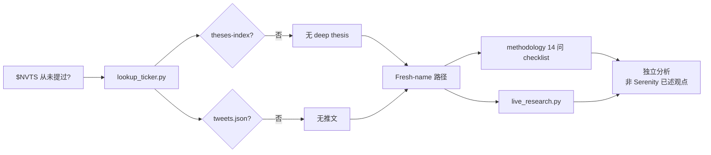

<div align="center">

# Serenity Twin

**A queryable digital twin of Serenity ([@aleabitoreddit](https://x.com/aleabitoreddit)) — corpus, live web, radar, and bottleneck research workflows**

[](LICENSE)
[](requirements.txt)
[](SKILL.md)
[](#corpus)
[](#maturity--quality-grade)
[](#browser-agent-ui)

[Quick start](#quick-start) · [Architecture](#architecture) · [Data flow & output](#data-flow--output) · [Query modes](#query-modes-a–e) · [Grading](#maturity--quality-grade) · [中文](#中文版本)

</div>

---

> **Research support only.** Ranked priorities and reasoning — not buy/sell instructions, not auto-trading. **Not affiliated with @aleabitoreddit.**

---

## Disclaimer — research distill, not Serenity herself

**Serenity Twin** is an **independent research tool** (OlaXBT). It is **not** Serenity ([@aleabitoreddit](https://x.com/aleabitoreddit)), does **not** speak for her, and does **not** impersonate her.

| | |
|---|---|
| **What it is** | A pipeline that **distills her public posts and articles** into a structured, queryable corpus + live-aware research workflows |
| **What it is not** | Her real-time view, an official product, investment advice, or trade execution |
| **How to read outputs** | Labelled *Serenity corpus view* vs *live verification* vs *research map* — always cross-check price, news, and thesis age |
| **Corpus limits** | Bundled archive may lag; views evolve; distilled bullets can be incomplete or stale |

This disclaimer appears in the **browser UI** (footer + empty state), in every **report** (footer line), and in **`SKILL.md`** agent rules.

### Agent answer quality (browser LLM)

Quality is controlled in **layers** — not one magic prompt:

| Layer | What it guarantees | Command / file |
|-------|-------------------|----------------|
| **Corpus & scripts** | Deterministic thesis, radar, live quote/news | `python scripts/run_qc.py`, `pytest tests/` |
| **Structured report** | Tables, charts, thesis cards before any LLM text | `serenity_twin/ui_render.py` |
| **Agent system prompt** | Language, section headers, evidence rules, no buy/sell | `serenity_twin/agent_prompt.py` |
| **Context boundary** | LLM sees only executed JSON context (no invented tickers) | `serenity_twin/llm_stream.py` |
| **Locale check** | Flags Chinese headers in English answers | `serenity_twin/agent_output.py` |
| **Human review** | Corpus distill + stale thesis cross-check | `distillation/MAINTENANCE.md` |

Re-run `python -m pytest tests/ -q` after corpus edits. Tune narrative quality via `agent_prompt.py` and `temperature` in `llm_stream.py` (default `0.3`).

---

## At a glance

| | |
|---|---|
| **What** | Agent Skill + Python toolkit + browser UI that distills Serenity's public research into structured, live-aware investment research |
| **Primary question** | *What does Serenity think about ticker X — and is that view still valid today?* |
| **One command** | `python aio_serenity.py` — auto-init + browser research agent (OlaXBT) |
| **Stack** | Python 3.10+ (stdlib core), optional DeepSeek / X API, Cursor or OpenClaw |
| **Maturity** | **8.9 / 10** — production-ready research MVP ([details](#maturity--quality-grade)) |

---

## What you can do

| Capability | Example prompt |
|------------|----------------|
| **Her conviction on a ticker** | *What is Serenity's view on $SIVE? Stance, tier evolution, key risks.* |
| **Attention Radar** | *14-day heating & new entrants — cross-check theses.* |
| **Map a theme to bottlenecks** | *Deep-scan A-share AI semiconductors — scarce layers first, then stocks.* |
| **One-page research memo** | *$SIVE thesis memo with evidence ladder and falsifiers.* |
| **Learn her research method** | *Serenity-style bottleneck research — one question at a time.* |

Full prompt catalog: [`docs/sample_prompts.md`](docs/sample_prompts.md)

---

## Why Serenity Twin exists

Serenity's research lens is distinctive: trace **hyperscaler capex upstream** to the **single chokepoint** — sole or near-sole supply, hard to design around, often still small-cap. Her public feed is high-volume, multi-ticker, and views evolve over time.

Serenity Twin packages three things other tools don't combine:

1. **Memory** — 5,800+ tweet archive, 43 deep thesis tickers, methodology, track-record, articles  
2. **Workflows** — `SKILL.md` routes Agent queries through deterministic scripts + evidence rules  
3. **Live world** — auto-fetched quotes, news, SEC (no need to say *"search the internet"*)  
4. **Radar** — mention analytics for Heating / new entrants / theme rotation  

---

## Quick start

### Requirements

- **Python 3.10+** — core scripts use stdlib only (no `pip install` required)
- **Optional:** DeepSeek in `.env` (browser UI LLM) or Cursor Settings → Models (chat)
- **Optional:** `X_BEARER_TOKEN` for live tweet sync

### One command (recommended)

```bash
git clone https://github.com/YOUR_ORG/serenity-twin.git
cd serenity-twin
python aio_serenity.py
```

| Step | What happens |
|------|----------------|
| **First run** | Auto-runs `init_system.py` — validate skill, normalize corpus, split theses, rebuild mentions, QC, install Cursor skill, seed `.env` |
| **Every run** | Opens UI at `http://127.0.0.1:17876` — prompts **system browser** or **Cursor Simple Browser** |
| **Each prompt** | Server auto-runs `lookup_ticker.py` + `live_research.py` + structured HTML report |

You **never** manually run lookup or live-research per question — the UI and Agent do that.

```bash
python aio_serenity.py --init          # init only
python aio_serenity.py --port 3000     # custom port
python aio_serenity.py --open cursor   # Cursor Simple Browser (inside IDE)
python aio_serenity.py --open browser  # system browser
python aio_serenity.py --no-browser    # headless server — URL in terminal
```

**Cursor Simple Browser:** point it at `http://127.0.0.1:17876` while the server is running (not the raw `index.html` file). Manual: `Ctrl+Shift+P` → **Simple Browser: Show** → paste URL.

**`.env`:** remove `#` from the key line — `# DEEPSEEK_API_KEY=...` is a comment and is ignored.

More: [`docs/QUICKSTART.md`](docs/QUICKSTART.md)

---

## Three ways to interact



| Surface | Command / trigger | Best for |
|---------|-------------------|----------|
| **Browser agent UI** | `python aio_serenity.py` | Testing prompts, tables, price charts, bilingual UI |
| **Cursor Chat** | Agent mode + `serenity-twin` / natural question | Deep research sessions, web search, editing corpus |
| **OpenClaw** | Install skill + gateway web tools | 24/7 cron, Telegram briefs ([`docs/SETUP.md`](docs/SETUP.md)) |

---

## Architecture

Four layers: **corpus memory → deterministic tools → optional sync → Agent reasoning**.



Full design doc: [`docs/ARCHITECTURE.md`](docs/ARCHITECTURE.md)

---

## Data flow & output

How a single ticker question becomes a structured answer — **automatically**, without the user asking for web search.



### Output sections (Mode A example)

| Section | Source | UI format |
|---------|--------|-----------|
| Serenity corpus thesis | `theses/*.md` via lookup | Collapsible card + expand full thesis |
| Live market | `live_research.py` | Metric table + 3-month line chart |
| Recent tweets | `tweets.json` | Tweet cards with links |
| Web sources | DuckDuckGo + SEC | Clickable source cards |
| Corpus vs live | Reconciliation rule | Warning alert if potentially stale |

---

## Fresh ticker flow (never mentioned by Serenity)



---

## Query modes A–E

| Mode | Trigger | Scripts (auto) | Output |
|------|---------|----------------|--------|
| **A — Ticker view** | `$TICKER`, Serenity's view | `live_research` → `lookup_ticker` | Corpus stance + live verification + 5-section analysis |
| **B — Radar** | ramp, heating, attention | `radar` → `lookup` per name | Heating / new entrants / conviction / theme rotation tables |
| **C — Theme scan** | supply chain, A-share, ETF | `live_research --theme` + workflow | Layer ranking → stock list → optional ETF holdings check |
| **D — Research memo** | 深度研报, thesis memo | Mode C/A + template | Full memo: system change → bottleneck → evidence → falsifiers |
| **E — Learning** | teach me the method | methodology files | One question per turn; tickers as examples only |



---

## Browser agent UI

Light-mode interface (purple accent `#e781fd`) with **English / 中文** toggle. Built and maintained by **[OlaXBT](https://www.olaxbt.xyz)** — free for the dev community.

| Feature | Detail |
|---------|--------|
| Entry | `python aio_serenity.py` |
| Default URL | `http://127.0.0.1:17876` (auto next port if busy) |
| **Agent plan UX** | Cursor/Manus-style step list — route → corpus → live web → render → LLM — with light animations (no blank “crashed” screen) |
| Auto live web | Yahoo quote, 3M chart, news search, SEC — every analysis prompt |
| Structured output | Tables, metric cards, tweet cards, source cards — not raw markdown walls |
| **Agent narrative** | Auto-enabled when `DEEPSEEK_API_KEY` is in `.env` — sidebar shows setup steps if missing |
| **Cursor Auto / Codex** | **Not available in browser** — use Cursor Agent chat + `SKILL.md` instead ([why](#why-cant-the-browser-use-cursor-autocodex)) |

### Why can't the browser use Cursor Auto/Codex?

The browser UI is a **standalone Python server** (`aio_serenity.py`). It runs outside the Cursor IDE and **cannot call Cursor's built-in models** (Auto, Codex, Claude, etc.) — those APIs are only available inside Cursor Agent chat.

| Surface | Agent narrative | How |
|---------|----------------|-----|
| **Browser UI** | Needs `DEEPSEEK_API_KEY` in `.env` | Python server calls DeepSeek directly |
| **Cursor Agent** | Uses your Cursor model (Auto, Codex, …) | Load skill → ask in Agent mode — **no browser API key** |

Both surfaces run the **same scripts** (`lookup_ticker`, `live_research`, radar). Only the **LLM narration layer** differs.

When the browser opens without a key, the sidebar shows **`.env` setup instructions** (file path + restart steps).

---
| **Task-oriented prompts** | Sidebar labels describe research tasks (not “Mode A/B/C”) — see [`ui/prompts.json`](ui/prompts.json) |
| Serenity avatar | Brand, empty state, and agent plan header — `ui/assets/serenity.png` |
| Session history | SQLite at `corpus/data/sessions.db` |
| **OlaXBT links** | Sidebar shortcuts → [olaxbt.xyz](https://www.olaxbt.xyz), [AI Market Maker](https://github.com/olaxbt/ai-market-maker), [X](https://x.com/olaxbt_terminal), [Medium](https://medium.com/olaxbt), [YouTube](https://www.youtube.com/@Olaxbt), [Nexus](https://nexus.olaxbt.xyz/app/) (Serenity Twin repo link placeholder) |

---

## Optional: live tweet sync

Default **off**. Without `X_BEARER_TOKEN`, bundled corpus works; sync exits cleanly with `status: disabled`.

```bash
cp .env.example .env
# X_BEARER_TOKEN=...
```

```json
{ "twitter_sync_enabled": true }
```

```bash
python scripts/sync_tweets.py --include-replies --distill
python scripts/agent_distill.py --since-sync
python scripts/rebuild_mentions.py
```

Daily automation (Windows): [`scripts/daily_brief.ps1`](scripts/daily_brief.ps1)

GitHub cron: [`.github/workflows/weekly-sync.yml`](.github/workflows/weekly-sync.yml)

---

## Corpus

| Path | Contents |
|------|----------|
| `corpus/data/tweets.json` | Canonical archive — **5,826** posts |
| `corpus/references/theses/*.md` | Sector thesis files — **43** deep tickers in index |
| `corpus/references/methodology.md` | 14 transferable principles + runnable checklist |
| `corpus/references/track-record.md` | Dated calls + calibration |
| `corpus/references/articles.md` | Long-form X Article summaries |
| `corpus/data/mentions-*.csv` | Mention analytics — **724** tickers |

---

## Python scripts

| Script | Purpose | Network |
|--------|---------|---------|
| [`aio_serenity.py`](aio_serenity.py) | **All-in-one** init + browser UI | yes (UI) |
| [`scripts/init_system.py`](scripts/init_system.py) | Production init + QC | no |
| [`scripts/lookup_ticker.py`](scripts/lookup_ticker.py) | Thesis + tweets + radar hint | no |
| [`scripts/live_research.py`](scripts/live_research.py) | Quote + news + SEC | yes |
| [`scripts/radar.py`](scripts/radar.py) | Attention momentum | no |
| [`scripts/sync_tweets.py`](scripts/sync_tweets.py) | Merge X API into archive | optional X |
| [`scripts/agent_distill.py`](scripts/agent_distill.py) | Auto thesis / track-record write-back | optional LLM |
| [`scripts/run_qc.py`](scripts/run_qc.py) | Full quality-control suite | no |
| [`scripts/daily_brief.ps1`](scripts/daily_brief.ps1) | Scheduled refresh + radar snapshot | optional X |

---

## API keys

| Use | Where |
|-----|-------|
| Cursor chat LLM | **Cursor Settings → Models** |
| Browser UI LLM (optional) | `.env` → `DEEPSEEK_API_KEY` |
| Live tweet sync (optional) | `.env` → `X_BEARER_TOKEN` + `config.json` |

---

## Project structure

```text
serenity-twin/
├── aio_serenity.py             # ← start here
├── SKILL.md                    # Agent Skill entry (Cursor / OpenClaw)
├── README.md
├── ui/                         # Browser agent (HTML/CSS/JS + i18n)
├── docs/
│   ├── ARCHITECTURE.md
│   ├── QUICKSTART.md
│   ├── SETUP.md
│   └── sample_prompts.md
├── corpus/                     # Digital twin memory
│   ├── data/                   # tweets.json, mentions CSVs
│   └── references/             # theses, methodology, track-record
├── reasoning/                  # Deep research workflows + templates
├── distillation/               # Corpus maintenance playbook
├── scripts/                    # CLI tools
├── serenity_twin/              # Shared Python package
├── tests/                      # pytest suite
└── evals/                      # ticker lookup evals
```

---

## Maturity & quality grade

**Overall: 8.9 / 10** — shippable research-agent MVP, not a fully autonomous trader.

| Dimension | Score | Notes |
|-----------|-------|-------|
| Corpus & tooling | ★★★★☆ | 5.8k tweets, 43 deep theses, lookup/radar/distill/QC |
| Agent Skill (`SKILL.md`) | ★★★★★ | Modes A–E, mandatory live verification, script-first rules |
| Browser UI | ★★★★☆ | Purple light UI, agent plan steps, tables/charts, EN/中文, sessions + streaming + mobile |
| Auto live web | ★★★★☆ | Quote + chart + news + SEC |
| **Stale thesis detection** | ★★★★☆ | **Code-level** — `stale_check.py` (corpus date vs price %) |
| Automation / cron | ★★★☆☆ | `daily_brief.ps1`, GitHub weekly workflow |
| Tests & evals | ★★★★☆ | **24 pytest** incl. E2E output (chart/table) + stale + session store |
| Documentation | ★★★★☆ | Architecture, quickstart, sample prompts, UI roadmap spec |

### What would make it 9.5/10

| Item | Status | Notes |
|------|--------|-------|
| **Stale thesis detection** | ✅ Done | `serenity_twin/stale_check.py` — UI alert with date + price % |
| **E2E output tests** | ✅ Done | `tests/test_e2e_output.py` — Mode A must include chart + table |
| **Mode C/D long memos in browser UI** | ✅ With DeepSeek | Same SKILL prompt + scripts as Cursor; set `DEEPSEEK_API_KEY` ([below](#mode-cd-who-writes-the-long-memo)) |
| **A-share primary disclosures** | Out of scope | Data-source layer, not agent maturity — excluded from score |
| **Streaming / session / mobile** | ✅ Done (v0.3) | See [`docs/UI_ROADMAP.md`](docs/UI_ROADMAP.md) |
| Premium search API + E2E Agent compliance tests | Planned | Assert Cursor runs `live_research` + `lookup` on every ticker prompt ([FAQ](#agent-compliance-e2e-cursor-only)) |

### Mode C/D: who writes the long memo?

| Runtime | Mode C/D long 研报 | Why |
|---------|-------------------|-----|
| **Browser UI + `DEEPSEEK_API_KEY`** | ✅ **Recommended if you prefer UI over Cursor chat** | Same script chain (`live_research`, `lookup_ticker`, radar) + `SKILL.md` system prompt via `agent_prompt.py`; SSE streaming + session history |
| **Cursor Agent (Auto, Codex, DeepSeek, etc.)** | ✅ Yes | SKILL + web/search tools + long context; best when you want broader live search beyond Yahoo/DDG/SEC |
| **Browser UI without `DEEPSEEK_API_KEY`** | ⚠️ Partial | Structured tables/charts + workflow skeleton only — not a full narrative memo |

**Conclusion:** You can use **either** surface. Browser UI now follows the **same agent path** (scripts first, then LLM synthesis). Cursor still wins on **open-ended web search breadth**; browser UI wins on **layout, charts, and not leaving the browser**.

### Agent compliance E2E (Cursor only)

**Not built yet** — this is a *test category*, not a feature you run today.

It would mean automated tests that prove: when you ask a ticker question in **Cursor Agent**, the agent **actually executes** `live_research.py` and `lookup_ticker.py` (per `SKILL.md`), instead of answering from LLM memory alone.

That is different from `tests/test_e2e_output.py`, which validates **Python pipeline output** (HTML must contain chart + table), not Cursor IDE behavior. Building Cursor compliance E2E would need a harness (Cursor SDK, mocked shell tool, or eval runner) — planned, not implemented.

---

## Provenance

Unified from three open-source Serenity skill projects:

| Source | Contribution |
|--------|--------------|
| [yan-labs/serenity-aleabitoreddit](https://github.com/yan-labs/serenity-aleabitoreddit) | Tweet archive, theses, methodology, track-record |
| [lanfuli/aleabito-serenity-skills](https://github.com/lanfuli/aleabito-serenity-skills) | Radar patterns, method framework |
| [muxuuu/serenity-skill](https://github.com/muxuuu/serenity-skill) | A-share/HK workflow, scorecard |

**Publish only this repo** (`serenity-twin/`). Reference clones are for provenance — do not republish them.

---

## Disclaimer

- Serenity's self-reported returns are unverified; public feeds have survivorship bias  
- Many names are volatile micro/small-caps; theses decay — confirm current fundamentals  
- Social posts are **leads**; high-confidence claims require filings and exchange disclosures  
- This project is a **research lens**, not a signal feed or trading bot  

---

## License

[MIT](LICENSE)

---

<div align="center">

---

# 中文版本

*Below is a Chinese translation of the English README above. The repository code and docs remain English.*

---

</div>

<div align="center">

# Serenity Twin

**Serenity ([@aleabitoreddit](https://x.com/aleabitoreddit)) 数字孪生 — 语料、自动联网、雷达与瓶颈投研工作流**

</div>

---

> **仅作研究辅助。** 提供研究优先级与推理，不构成投资建议，不执行交易。**与 @aleabitoreddit 无隶属关系。**

---

## 免责声明 — 研究蒸馏工具，非 Serenity 本人

**Serenity Twin** 是 **OlaXBT 独立开发的投研工具**，**不是** Serenity（[@aleabitoreddit](https://x.com/aleabitoreddit)）本人，**不代表**她的观点，也**不冒充**她。

| | |
|---|---|
| **是什么** | 将她**公开推文与文章**蒸馏为可查询语料 + 可联网的研究工作流 |
| **不是什么** | 她的实时观点、官方产品、投资建议或交易执行 |
| **如何阅读输出** | 区分 *语料观点* / *实时核验* / *研究地图* — 务必对照现价、新闻与 thesis 时效 |
| **语料局限** | 打包语料可能滞后；观点会演变；蒸馏摘要可能不完整或 stale |

免责声明同时出现在 **浏览器 UI**（页脚与空状态）、**每份报告** 页脚，以及 **`SKILL.md`** Agent 规则中。

---

## 一览

| | |
|---|---|
| **是什么** | Agent Skill + Python 工具包 + 浏览器 UI，将 Serenity 公开研究蒸馏为结构化、可联网的投研输出 |
| **核心问题** | *Serenity 对某 ticker 怎么看？该观点今天是否仍然成立？* |
| **一条命令** | `python aio_serenity.py` — 自动初始化 + Perplexity 风格浏览器 Agent |
| **技术栈** | Python 3.10+（核心 stdlib）、可选 DeepSeek / X API、Cursor 或 OpenClaw |
| **成熟度** | **8.9 / 10** — 可发布的投研 Agent MVP（[详见](#成熟度与质量评分-1)） |

---

## 能做什么

| 能力 | 示例 |
|------|------|
| **标的观点 (Mode A)** | *Serenity 对 $SIVE 怎么看？conviction、演变、风险* |
| **注意力雷达 (Mode B)** | *她最近在 ramp 什么？14 天 radar + cross-check theses* |
| **产业链扫描 (Mode C)** | *A 股 AI 半导体深度 scan — 先 scarce layer，再个股与 ETF* |
| **深度研报 (Mode D)** | *写 $SIVE 单页 thesis memo，含证据阶梯与证伪条件* |
| **学方法 (Mode E)** | *带我学 Serenity 式瓶颈投研，每次只问一个问题* |

完整 prompt：[`docs/sample_prompts.md`](docs/sample_prompts.md)

---

## 为什么需要 Serenity Twin

Serenity 的 lens 很清晰：从 **hyperscaler capex** 往上游追 **唯一/近乎唯一的卡点**。但她发帖量大、标的分散、观点会演变。

Serenity Twin 把四件事合在一起：

1. **记忆** — 5800+ 推文、43 条深度 thesis、方法论、track-record  
2. **工作流** — `SKILL.md` 驱动 Agent 先跑脚本、再按证据规则输出  
3. **实时世界** — 自动拉现价、新闻、SEC（无需说「去联网」）  
4. **雷达** — Heating / 新进 / 主题轮动  

---

## 快速开始

```bash
git clone https://github.com/YOUR_ORG/serenity-twin.git
cd serenity-twin
python aio_serenity.py
```

| 步骤 | 说明 |
|------|------|
| **首次运行** | 自动 `init_system.py` — 语料、theses、mentions、QC、Cursor Skill、`.env` |
| **每次运行** | 打开浏览器 UI（默认 `http://127.0.0.1:17876`，端口占用则自动递增） |
| **每个问题** | 服务端自动跑 `lookup_ticker.py` + `live_research.py` + 结构化 HTML |

你**不需要**每次手动跑 lookup / live-research。

---

## 三种使用方式

| 入口 | 命令 | 适合 |
|------|------|------|
| **浏览器 Agent UI** | `python aio_serenity.py` | 试 prompt、表格、价格图、中英 UI |
| **Cursor Chat** | Agent 模式 + `serenity-twin` | 深度调研、联网、编辑语料 |
| **OpenClaw** | 安装 Skill + gateway web | 24/7 cron、Telegram（社区） |

---

## 架构（四层）

**语料记忆 → 确定性工具 → 可选同步 → Agent 推理**

与英文版相同的架构图见上文 [Architecture](#architecture) Mermaid 图。

---

## 数据流与输出

用户问一个 ticker → **自动**完成语料查询 + 联网核验 → 结构化输出。



### 输出模块（Mode A 示例）

| 模块 | 来源 | UI 形式 |
|------|------|---------|
| Serenity thesis | `theses/*.md` | 可折叠卡片 + 展开全文 |
| 实时市场 | `live_research.py` | 指标表 + 3 个月折线图 |
| 近期推文 | `tweets.json` | 推文卡片 |
| 联网来源 | 新闻搜索 + SEC | 可点击来源卡片 |
| 语料 vs 实时 | 对账规则 | 可能 stale 时黄色提示 |

---

## 未覆盖 ticker 流程



---

## 查询模式 A–E

| 模式 | 触发 | 自动脚本 | 输出 |
|------|------|----------|------|
| **A** | 单 ticker 观点 | live + lookup | 语料 + 实时核验 + 五段式 |
| **B** | ramp / heating | radar + lookup | 升温 / 新进 / 主题轮动表 |
| **C** | 产业链 / A股 / ETF | live theme + workflow | 先排层 → 个股 → 可选 ETF |
| **D** | 深度研报 | C/A + template | 完整 memo |
| **E** | 学方法 | methodology | 每次一问，不荐股 |

---

## 浏览器 Agent UI

- 入口：`python aio_serenity.py`  
- 浅色界面，紫色主题（`#e781fd`），**中/EN** 切换  
- **Agent 步骤面板**（类似 Cursor Plan）：识别模式 → 语料 → 联网 → 报告 → LLM，带动画  
- **研究任务**侧边栏：任务导向命名（非 Mode A/B/C），见 [`ui/prompts.json`](ui/prompts.json)  
- **DeepSeek 叙述**：由 `.env` 自动启用；无 Key 时侧边栏显示配置指引  
- **Cursor Auto/Codex**：**浏览器不可用** — 请在 Cursor Agent 聊天中使用 SKILL.md  
- Serenity 头像：`ui/assets/serenity.png`（品牌区、空状态、Agent 执行面板）  
- 侧边栏 **OlaXBT 社区链接**：[官网](https://www.olaxbt.xyz)、[AI Market Maker](https://github.com/olaxbt/ai-market-maker)、[X](https://x.com/olaxbt_terminal)、[Medium](https://medium.com/olaxbt)、[YouTube](https://www.youtube.com/@Olaxbt)、[Nexus](https://nexus.olaxbt.xyz/app/)（本仓库 GitHub 链接占位）  
- **OlaXBT 团队出品**，免费开放给开发者社区  

---

## 可选：推文同步

`.env` → `X_BEARER_TOKEN`，`config.json` → `"twitter_sync_enabled": true`

```bash
python scripts/sync_tweets.py --include-replies --distill
python scripts/agent_distill.py --since-sync
python scripts/rebuild_mentions.py
```

Windows 每日刷新：`scripts/daily_brief.ps1`

---

## 语料库

| 路径 | 内容 |
|------|------|
| `corpus/data/tweets.json` | **5826** 帖 |
| `corpus/references/theses/*.md` | **43** 条深度 thesis |
| `corpus/references/methodology.md` | 14 条原则 + checklist |
| `corpus/data/mentions-*.csv` | **724** ticker 提及分析 |

---

## 成熟度与质量评分

**总评：8.9 / 10**

| 维度 | 评分 | 说明 |
|------|------|------|
| 语料与工具 | ★★★★☆ | 5800+ 推文、lookup/radar/distill/QC |
| Agent Skill | ★★★★★ | Mode A–E、强制 live verification |
| 浏览器 UI | ★★★★☆ | 紫色主题、Agent 步骤面板、表/图、双语、会话 + 流式 + 移动端 |
| 自动联网 | ★★★★☆ | 现价+图+新闻+SEC |
| **Stale 检测** | ★★★★☆ | **已实现** `stale_check.py` |
| 自动化 | ★★★☆☆ | daily_brief、GitHub weekly |
| 测试 | ★★★★☆ | **24 pytest** 含 E2E 输出 + session store |
| 文档 | ★★★★☆ | 架构、quickstart、UI roadmap 规格 |

### 到 9.5 分还需

| 项 | 状态 |
|----|------|
| Stale thesis 代码检测 | ✅ 已完成 |
| E2E 输出测试（chart/table） | ✅ 已完成 |
| Mode C/D 长研报 | **浏览器 UI + DeepSeek** 或 Cursor Agent；脚本路径已对齐 |
| A 股一手披露 | 暂不纳入成熟度（数据源层） |
| 流式 / 会话 / 移动端 | ✅ **v0.3 已实现** — [`docs/UI_ROADMAP.md`](docs/UI_ROADMAP.md) |
| Agent 合规 E2E、优质搜索 API | 计划中（见英文 [Agent compliance E2E](#agent-compliance-e2e-cursor-only)） |

---

## 来源与发布

整合自三个开源 Serenity skill 项目（见英文 [Provenance](#provenance) 表）。

**仅发布 `serenity-twin/` 本仓库** — 参考 clone 勿公开发布。

---

## 免责声明

- 自报收益未验证；thesis 会 decay  
- 社交帖仅为线索；高置信结论需公告/财报  
- 研究 lens，非信号源、非交易机器人  

---

## 许可证

[MIT](LICENSE)
