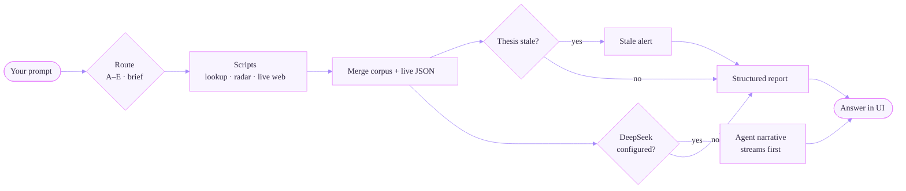

<div align="center">


# Serenity Twin

**A queryable digital twin of Serenity ([@aleabitoreddit](https://x.com/aleabitoreddit)) — corpus, live web, radar, and bottleneck research workflows**

[](LICENSE)
[](requirements.txt)
[](SKILL.md)
[](#corpus)
[](#maturity--quality-grade)
[](#browser-agent-ui)

[Quick start](#quick-start) · [Architecture](#architecture) · [Query flow](#query-flow) · [Query modes](#query-modes-a–e) · [中文](README.zh-CN.md)

</div>

---

> **Research support only.** Ranked priorities and reasoning — not buy/sell instructions, not auto-trading. **Not affiliated with @aleabitoreddit.**

---

## Disclaimer — research distill, not Serenity herself

**Serenity Twin** is an **independent research tool** (OlaXBT). It is **not** Serenity ([@aleabitoreddit](https://x.com/aleabitoreddit)), does **not** speak for her, and does **not** impersonate her.

| | |
|---|---|
| **What it is** | A pipeline that **distills her public posts and articles** into a structured, queryable corpus + live-aware research workflows |
| **What it is not** | Her real-time view, an official product, investment advice, or trade execution |
| **How to read outputs** | Labelled *Serenity corpus view* vs *live verification* vs *research map* — always cross-check price, news, and thesis age |
| **Corpus limits** | Bundled archive may lag; views evolve; distilled bullets can be incomplete or stale |

This disclaimer appears in the **browser UI** (footer + empty state), in every **report** (footer line), and in **`SKILL.md`** agent rules.

### Agent answer quality (browser LLM)

Quality is controlled in **layers** — not one magic prompt:

| Layer | What it guarantees | Command / file |
|-------|-------------------|----------------|
| **Corpus & scripts** | Deterministic thesis, radar, live quote/news | `python scripts/run_qc.py`, `pytest tests/` |
| **Structured report** | Tables, charts, thesis cards before any LLM text | `serenity_twin/ui_render.py` |
| **Agent system prompt** | Language, section headers, evidence rules, no buy/sell | `serenity_twin/agent_prompt.py` |
| **Context boundary** | LLM sees only executed JSON context (no invented tickers) | `serenity_twin/llm_stream.py` |
| **Locale check** | Flags Chinese headers in English answers | `serenity_twin/agent_output.py` |
| **Human review** | Corpus distill + stale thesis cross-check | `distillation/MAINTENANCE.md` |

Re-run `python -m pytest tests/ -q` after corpus edits. Tune narrative quality via `agent_prompt.py` and `temperature` in `llm_stream.py` (default `0.3`).

---

## At a glance

| | |
|---|---|
| **What** | Agent Skill + Python toolkit + browser UI that distills Serenity's public research into structured, live-aware investment research |
| **Primary question** | *What does Serenity think about ticker X — and is that view still valid today?* |
| **One command** | `python aio_serenity.py` — auto-init + browser research agent (OlaXBT) |
| **Stack** | Python 3.10+ (stdlib core), optional DeepSeek / X API, Cursor or OpenClaw |
| **Maturity** | **8.9 / 10** — production-ready research MVP ([details](#maturity--quality-grade)) |

---

## What you can do

| Capability | Example prompt |
|------------|----------------|
| **Her conviction on a ticker** | *What is Serenity's view on $SIVE? Stance, tier evolution, key risks.* |
| **Attention Radar** | *14-day heating & new entrants — cross-check theses.* |
| **Map a theme to bottlenecks** | *Deep-scan A-share AI semiconductors — scarce layers first, then stocks.* |
| **One-page research memo** | *$SIVE thesis memo with evidence ladder and falsifiers.* |
| **Learn her research method** | *Serenity-style bottleneck research — one question at a time.* |

Full prompt catalog: [`docs/sample_prompts.md`](docs/sample_prompts.md)

---

## Why Serenity Twin exists

Serenity's research lens is distinctive: trace **hyperscaler capex upstream** to the **single chokepoint** — sole or near-sole supply, hard to design around, often still small-cap. Her public feed is high-volume, multi-ticker, and views evolve over time.

Serenity Twin packages four things other tools don't combine:

1. **Memory** — 5,800+ tweet archive, 43 deep thesis tickers, methodology, track-record, articles  
2. **Workflows** — `SKILL.md` routes Agent queries through deterministic scripts + evidence rules  
3. **Live world** — auto-fetched quotes, news, SEC (no need to say *"search the internet"*)  
4. **Radar** — mention analytics for Heating / new entrants / theme rotation  

---

## Quick start

### Requirements

- **Python 3.10+** — core scripts use stdlib only (no `pip install` required)
- **Optional:** DeepSeek in `.env` (browser UI LLM) or Cursor Settings → Models (chat)
- **Optional:** `X_BEARER_TOKEN` for live tweet sync

### One command (recommended)

```bash
git clone https://github.com/olaxbt/serenity-skill.git
cd serenity-skill
python aio_serenity.py
```

| Step | What happens |
|------|----------------|
| **First run** | Auto-runs `init_system.py` — validate skill, normalize corpus, split theses, rebuild mentions, QC, install Cursor skill, seed `.env` |
| **Every run** | Opens UI at `http://127.0.0.1:17876` — prompts **system browser** or **Cursor Simple Browser** |
| **Each prompt** | Server auto-runs `lookup_ticker.py` + `live_research.py` + structured HTML report |

You **never** manually run lookup or live-research per question — the UI and Agent do that.

```bash
python aio_serenity.py --init          # init only
python aio_serenity.py --port 3000     # custom port
python aio_serenity.py --open cursor   # Cursor Simple Browser (inside IDE)
python aio_serenity.py --open browser  # system browser
python aio_serenity.py --no-browser    # headless server — URL in terminal
```

**Cursor Simple Browser:** point it at `http://127.0.0.1:17876` while the server is running (not the raw `index.html` file). Manual: `Ctrl+Shift+P` → **Simple Browser: Show** → paste URL.

**`.env`:** remove `#` from the key line — `# DEEPSEEK_API_KEY=...` is a comment and is ignored.

More: [`docs/QUICKSTART.md`](docs/QUICKSTART.md)

---

## Three ways to interact

| Surface | Command / trigger | Best for |
|---------|-------------------|----------|
| **Browser agent UI** | `python aio_serenity.py` | Testing prompts, tables, price charts, bilingual UI, SSE streaming |
| **Cursor Chat** | Agent mode + `serenity-twin` / natural question | Deep research sessions, web search, editing corpus |
| **OpenClaw** | Install skill + gateway web tools | 24/7 cron, Telegram briefs ([`docs/SETUP.md`](docs/SETUP.md)) |

All three surfaces share the same Python scripts and corpus. Only the **LLM narration layer** differs (DeepSeek in browser vs Cursor models in chat).

---

## Architecture

Four layers — no separate runtime per surface:

| Layer | Role | Key paths |
|-------|------|-----------|
| **0 — Corpus memory** | Distilled tweets, theses, methodology, track-record | `corpus/data/`, `corpus/references/` |
| **1 — Python tools** | Deterministic lookup, radar, live web, sync, distill | `scripts/`, `serenity_twin/` |
| **2 — Live world** | Yahoo quotes (incl. crypto spot aliases e.g. `BTC-USD`), news, SEC | `live_research.py`, `web_research.py` |
| **3 — Agent reasoning** | Mode router + optional LLM synthesis | `SKILL.md`, `agent_prompt.py`, `ui_chat.py` |

Extended workflows (theme scans, evidence ladder, A-share playbook) live under `reasoning/references/`.

Full design doc: [`docs/ARCHITECTURE.md`](docs/ARCHITECTURE.md)

---

## Query flow

One prompt → routed mode → scripts execute → structured report → optional agent narrative. The browser streams progress over SSE (route → corpus → live web → render → LLM).



**Report layout (v0.3.8):**

1. **Agent answer** — LLM synthesis at the top when `DEEPSEEK_API_KEY` is set (locale follows your prompt, not the UI toggle)  
2. **Supporting data** — live quote table + chart, thesis cards with tiered evidence, radar tables, stale warnings  
3. **References** — tweets, web sources, SEC — collapsed by default  
4. **Disclaimer** — footer on every report  

Without DeepSeek, step 1 is omitted and a deterministic synthesis block may appear instead.

**Fresh ticker (never in corpus):** `lookup_ticker.py` returns `found_in_theses = false` → follow `methodology.md` 14-question checklist + `live_research.py` → output is **independent analysis**, not Serenity's stated view. Partial coverage (tweets only, no deep thesis) uses tweets as leads into the same checklist.

---

## Query modes A–E

| Mode | Trigger | Scripts (auto) | Output |
|------|---------|----------------|--------|
| **A — Ticker view** | `$TICKER`, Serenity's view, fresh-name / methodology checklist | `live_research` → `lookup_ticker` | Corpus stance + live verification + agent narrative |
| **B — Radar** | ramp, heating, attention | `radar` → live web on top heating names | Heating / new entrants / conviction / theme rotation tables |
| **C — Theme scan** | supply chain, A-share, ETF | `live_research --theme` + workflow | Layer ranking → stock list → optional ETF holdings check |
| **D — Research memo** | 深度研报, thesis memo | Mode C/A + template | Full memo: system change → bottleneck → evidence → falsifiers |
| **E — Learning** | teach me the method | methodology files | One question per turn; tickers as examples only |
| **brief** | daily brief | `daily-brief-latest.txt` + radar | Snapshot table from scheduled refresh |

---

## Browser agent UI

Light-mode interface (purple accent `#e781fd`, **v0.3.8**) with **English / 中文** chrome toggle. Built and maintained by **[OlaXBT](https://www.olaxbt.xyz)** — free for the dev community.

| Feature | Detail |
|---------|--------|
| Entry | `python aio_serenity.py` |
| Default URL | `http://127.0.0.1:17876` (auto next port if busy) |
| **Agent plan UX** | Cursor-style step list — route → corpus → live web → render → LLM — with streaming progress |
| Auto live web | Yahoo quote, 3M chart, news search, SEC — every analysis prompt; crypto uses spot symbols (`BTC-USD`, not ETF tickers) |
| Structured output | Tables, metric cards, thesis cards — references demoted to collapsible section |
| **Agent narrative** | Auto-enabled when `DEEPSEEK_API_KEY` is in `.env` — rendered as markdown at top of report |
| **Answer locale** | Detected from your prompt text (`detect_prompt_locale`) — English prompts get English section headers |
| **Task-oriented prompts** | Sidebar labels describe research tasks — see [`ui/prompts.json`](ui/prompts.json) |
| Serenity avatar | Brand, empty state, agent plan — `ui/assets/serenity.png` |
| Session history | SQLite at `corpus/data/sessions.db` (v0.3+) |
| **Cursor Auto / Codex** | **Not available in browser** — use Cursor Agent chat + `SKILL.md` instead |

### Why can't the browser use Cursor Auto/Codex?

The browser UI is a **standalone Python server** (`aio_serenity.py`). It runs outside the Cursor IDE and **cannot call Cursor's built-in models** — those APIs are only available inside Cursor Agent chat.

| Surface | Agent narrative | How |
|---------|----------------|-----|
| **Browser UI** | Needs `DEEPSEEK_API_KEY` in `.env` | Python server calls DeepSeek directly |
| **Cursor Agent** | Uses your Cursor model (Auto, Codex, …) | Load skill → ask in Agent mode — **no browser API key** |

When the browser opens without a key, the sidebar shows **`.env` setup instructions** (file path + restart steps).

---

## Optional: live tweet sync

Default **off**. Without `X_BEARER_TOKEN`, bundled corpus works; sync exits cleanly with `status: disabled`.

```bash
cp .env.example .env
# X_BEARER_TOKEN=...
```

```json
{ "twitter_sync_enabled": true }
```

```bash
python scripts/sync_tweets.py --include-replies --distill
python scripts/agent_distill.py --since-sync
python scripts/rebuild_mentions.py
```

Daily automation (Windows): [`scripts/daily_brief.ps1`](scripts/daily_brief.ps1)

Optional CI: [`.github/workflows/weekly-sync.yml`](.github/workflows/weekly-sync.yml) (requires a PAT with `workflow` scope to push)

---

## Corpus

| Path | Contents |
|------|----------|
| `corpus/data/tweets.json` | Canonical archive — **5,826** posts |
| `corpus/references/theses/*.md` | Sector thesis files — **43** deep tickers in index |
| `corpus/references/methodology.md` | 14 transferable principles + runnable checklist |
| `corpus/references/track-record.md` | Dated calls + calibration |
| `corpus/references/articles.md` | Long-form X Article summaries |
| `corpus/data/mentions-*.csv` | Mention analytics — **724** tickers |

---

## Python scripts

| Script | Purpose | Network |
|--------|---------|---------|
| [`aio_serenity.py`](aio_serenity.py) | **All-in-one** init + browser UI | yes (UI) |
| [`scripts/init_system.py`](scripts/init_system.py) | Production init + QC | no |
| [`scripts/lookup_ticker.py`](scripts/lookup_ticker.py) | Thesis + tweets + radar hint | no |
| [`scripts/live_research.py`](scripts/live_research.py) | Quote + news + SEC | yes |
| [`scripts/radar.py`](scripts/radar.py) | Attention momentum | no |
| [`scripts/sync_tweets.py`](scripts/sync_tweets.py) | Merge X API into archive | optional X |
| [`scripts/agent_distill.py`](scripts/agent_distill.py) | Auto thesis / track-record write-back | optional LLM |
| [`scripts/run_qc.py`](scripts/run_qc.py) | Full quality-control suite | no |
| [`scripts/daily_brief.ps1`](scripts/daily_brief.ps1) | Scheduled refresh + radar snapshot | optional X |

---

## API keys

| Use | Where |
|-----|-------|
| Cursor chat LLM | **Cursor Settings → Models** |
| Browser UI LLM (optional) | `.env` → `DEEPSEEK_API_KEY` |
| Live tweet sync (optional) | `.env` → `X_BEARER_TOKEN` + `config.json` |

---

## Project structure

```text
serenity-skill/                 # GitHub repo root (local folder may be serenity-twin/)
├── aio_serenity.py             # ← start here
├── SKILL.md                    # Agent Skill entry (Cursor / OpenClaw)
├── README.md · README.zh-CN.md
├── ui/                         # Browser agent (HTML/CSS/JS + i18n)
├── docs/
│   ├── ARCHITECTURE.md
│   ├── QUICKSTART.md
│   ├── SETUP.md
│   └── sample_prompts.md
├── corpus/                     # Digital twin memory
│   ├── data/                   # tweets.json, mentions CSVs
│   └── references/             # theses, methodology, track-record
├── reasoning/                  # Deep research workflows + templates
├── distillation/               # Corpus maintenance playbook
├── scripts/                    # CLI tools
├── serenity_twin/              # Shared Python package
├── tests/                      # pytest suite
└── evals/                      # ticker lookup evals
```

---

## Maturity & quality grade

**Overall: 8.9 / 10** — shippable research-agent MVP, not a fully autonomous trader.

| Dimension | Score | Notes |
|-----------|-------|-------|
| Corpus & tooling | ★★★★☆ | 5.8k tweets, 43 deep theses, lookup/radar/distill/QC |
| Agent Skill (`SKILL.md`) | ★★★★★ | Modes A–E, mandatory live verification, script-first rules |
| Browser UI | ★★★★☆ | v0.3.8 — agent-first layout, streaming, EN/中文, sessions, mobile |
| Auto live web | ★★★★☆ | Quote + chart + news + SEC; crypto spot aliases |
| **Stale thesis detection** | ★★★★☆ | **Code-level** — `stale_check.py` (corpus date vs price %) |
| Automation / cron | ★★★☆☆ | `daily_brief.ps1`, optional GitHub weekly workflow |
| Tests & evals | ★★★★☆ | **39 pytest** incl. E2E output, stale, session store, UI formatting |
| Documentation | ★★★★☆ | Architecture, quickstart, sample prompts, UI roadmap spec |

### What would make it 9.5/10

| Item | Status | Notes |
|------|--------|-------|
| **Stale thesis detection** | ✅ Done | `serenity_twin/stale_check.py` — UI alert with date + price % |
| **E2E output tests** | ✅ Done | `tests/test_e2e_output.py` — Mode A must include chart + table |
| **Mode C/D long memos in browser UI** | ✅ With DeepSeek | Same SKILL prompt + scripts as Cursor; set `DEEPSEEK_API_KEY` |
| **Agent-first report layout** | ✅ Done (v0.3.8) | LLM answer top; references collapsed |
| **A-share primary disclosures** | Out of scope | Data-source layer, not agent maturity |
| **Streaming / session / mobile** | ✅ Done (v0.3+) | See [`docs/UI_ROADMAP.md`](docs/UI_ROADMAP.md) |
| Premium search API + E2E Agent compliance tests | Planned | Assert Cursor runs `live_research` + `lookup` on every ticker prompt |

### Mode C/D: who writes the long memo?

| Runtime | Mode C/D long memo | Why |
|---------|-------------------|-----|
| **Browser UI + `DEEPSEEK_API_KEY`** | ✅ Recommended | Same script chain + `SKILL.md` system prompt via `agent_prompt.py`; SSE streaming + session history |
| **Cursor Agent** | ✅ Yes | SKILL + web/search tools + long context |
| **Browser UI without key** | ⚠️ Partial | Structured tables/charts + workflow skeleton only |

---

## Provenance

Unified from three open-source Serenity skill projects:

| Source | Contribution |
|--------|--------------|
| [yan-labs/serenity-aleabitoreddit](https://github.com/yan-labs/serenity-aleabitoreddit) | Tweet archive, theses, methodology, track-record |
| [lanfuli/aleabito-serenity-skills](https://github.com/lanfuli/aleabito-serenity-skills) | Radar patterns, method framework |
| [muxuuu/serenity-skill](https://github.com/muxuuu/serenity-skill) | A-share/HK workflow, scorecard |

**Publish only this repo** ([olaxbt/serenity-skill](https://github.com/olaxbt/serenity-skill)). Reference clones are for provenance — do not republish them.

---

## Disclaimer

- Serenity's self-reported returns are unverified; public feeds have survivorship bias  
- Many names are volatile micro/small-caps; theses decay — confirm current fundamentals  
- Social posts are **leads**; high-confidence claims require filings and exchange disclosures  
- This project is a **research lens**, not a signal feed or trading bot  

---

## License

[MIT](LICENSE)

---

<div align="center">

**[简体中文 README →](README.zh-CN.md)**

</div>
