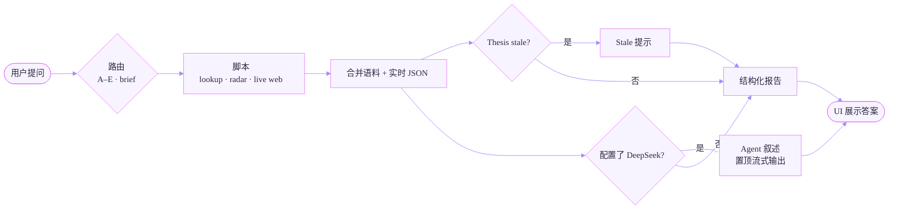

<div align="center">

# Serenity Twin

**Serenity ([@aleabitoreddit](https://x.com/aleabitoreddit)) 数字孪生 — 语料、自动联网、雷达与瓶颈投研工作流**

[](LICENSE)
[](requirements.txt)
[](SKILL.md)
[](#语料库)
[](#成熟度与质量评分)
[](#浏览器-agent-ui)

[快速开始](#快速开始) · [架构](#架构) · [查询流程](#查询流程) · [查询模式](#查询模式-ae) · [English](README.md)

</div>

---

> **仅作研究辅助。** 提供研究优先级与推理，不构成投资建议，不执行交易。**与 @aleabitoreddit 无隶属关系。**

---

## 免责声明 — 研究蒸馏工具，非 Serenity 本人

**Serenity Twin** 是 **OlaXBT 独立开发的投研工具**，**不是** Serenity（[@aleabitoreddit](https://x.com/aleabitoreddit)）本人，**不代表**她的观点，也**不冒充**她。

| | |
|---|---|
| **是什么** | 将她**公开推文与文章**蒸馏为可查询语料 + 可联网的研究工作流 |
| **不是什么** | 她的实时观点、官方产品、投资建议或交易执行 |
| **如何阅读输出** | 区分 *语料观点* / *实时核验* / *研究地图* — 务必对照现价、新闻与 thesis 时效 |
| **语料局限** | 打包语料可能滞后；观点会演变；蒸馏摘要可能不完整或 stale |

免责声明同时出现在 **浏览器 UI**（页脚与空状态）、**每份报告** 页脚，以及 **`SKILL.md`** Agent 规则中。

### Agent 回答质量（浏览器 LLM）

| 层级 | 保证什么 | 文件 / 命令 |
|------|----------|-------------|
| **语料与脚本** | 确定性 thesis、radar、现价/新闻 | `run_qc.py`、`pytest tests/` |
| **结构化报告** | 表格、图表、thesis 卡片 | `ui_render.py` |
| **Agent 系统提示** | 语言、章节标题、证据规则、禁止买卖建议 | `agent_prompt.py` |
| **上下文边界** | LLM 仅见已执行 JSON，不编造 ticker | `llm_stream.py` |
| **语言检查** | 英文提问却出现中文标题时告警 | `agent_output.py` |

语料修改后请运行 `python -m pytest tests/ -q`。

---

## 一览

| | |
|---|---|
| **是什么** | Agent Skill + Python 工具包 + 浏览器 UI，将 Serenity 公开研究蒸馏为结构化、可联网的投研输出 |
| **核心问题** | *Serenity 对某 ticker 怎么看？该观点今天是否仍然成立？* |
| **一条命令** | `python aio_serenity.py` — 自动初始化 + 浏览器研究 Agent（OlaXBT） |
| **技术栈** | Python 3.10+（核心 stdlib）、可选 DeepSeek / X API、Cursor 或 OpenClaw |
| **成熟度** | **8.9 / 10** — 可发布的投研 Agent MVP（[详见](#成熟度与质量评分)） |

---

## 能做什么

| 能力 | 示例 |
|------|------|
| **标的观点 (Mode A)** | *Serenity 对 $SIVE 怎么看？conviction、演变、风险* |
| **注意力雷达 (Mode B)** | *14 天 radar + cross-check theses* |
| **产业链扫描 (Mode C)** | *A 股 AI 半导体深度 scan — 先 scarce layer，再个股与 ETF* |
| **深度研报 (Mode D)** | *写 $SIVE 单页 thesis memo，含证据阶梯与证伪条件* |
| **学方法 (Mode E)** | *带我学 Serenity 式瓶颈投研，每次只问一个问题* |

完整 prompt：[`docs/sample_prompts.md`](docs/sample_prompts.md)

---

## 为什么需要 Serenity Twin

Serenity 的 lens 很清晰：从 **hyperscaler capex** 往上游追 **唯一/近乎唯一的卡点**。但她发帖量大、标的分散、观点会演变。

Serenity Twin 把四件事合在一起：

1. **记忆** — 5800+ 推文、43 条深度 thesis、方法论、track-record  
2. **工作流** — `SKILL.md` 驱动 Agent 先跑脚本、再按证据规则输出  
3. **实时世界** — 自动拉现价、新闻、SEC（无需说「去联网」）  
4. **雷达** — Heating / 新进 / 主题轮动  

---

## 快速开始

```bash
git clone https://github.com/olaxbt/serenity-skill.git
cd serenity-skill
python aio_serenity.py
```

| 步骤 | 说明 |
|------|------|
| **首次运行** | 自动 `init_system.py` — 语料、theses、mentions、QC、Cursor Skill、`.env` |
| **每次运行** | 打开浏览器 UI（默认 `http://127.0.0.1:17876`，端口占用则自动递增） |
| **每个问题** | 服务端自动跑 `lookup_ticker.py` + `live_research.py` + 结构化 HTML |

你**不需要**每次手动跑 lookup / live-research。

**`.env`：** 去掉 key 行前的 `#`，否则会被当作注释忽略。

更多：[`docs/QUICKSTART.md`](docs/QUICKSTART.md)

---

## 三种使用方式

| 入口 | 命令 | 适合 |
|------|------|------|
| **浏览器 Agent UI** | `python aio_serenity.py` | 试 prompt、表格、价格图、中英 UI、SSE 流式 |
| **Cursor Chat** | Agent 模式 + `serenity-twin` | 深度调研、联网、编辑语料 |
| **OpenClaw** | 安装 Skill + gateway web | 24/7 cron、Telegram（社区） |

三种入口共用同一套脚本与语料；**LLM 叙述层**不同（浏览器 DeepSeek vs Cursor 内置模型）。

---

## 架构

| 层级 | 作用 | 关键路径 |
|------|------|----------|
| **0 — 语料记忆** | 推文、thesis、方法论、track-record | `corpus/` |
| **1 — Python 工具** | lookup、radar、live web、sync、distill | `scripts/`、`serenity_twin/` |
| **2 — 实时世界** | Yahoo 现价（含 crypto 现货别名如 `BTC-USD`）、新闻、SEC | `live_research.py` |
| **3 — Agent 推理** | 模式路由 + 可选 LLM 合成 | `SKILL.md`、`agent_prompt.py` |

深度调研流程见 `reasoning/references/`。设计文档：[`docs/ARCHITECTURE.md`](docs/ARCHITECTURE.md)

---

## 查询流程

一次提问 → 路由模式 → 脚本执行 → 结构化报告 → 可选 Agent 叙述。浏览器通过 SSE 推送进度（路由 → 语料 → 联网 → 渲染 → LLM）。



**报告布局（v0.3.8）：**

1. **Agent 回答** — 配置 `DEEPSEEK_API_KEY` 时 LLM 合成置顶（语言跟随**提问内容**，非 UI 切换）  
2. **支撑数据** — 现价表 + 折线图、分层 thesis 卡片、radar 表、stale 警告  
3. **参考来源** — 推文、网页、SEC — **默认折叠**  
4. **免责声明** — 每份报告页脚  

无 DeepSeek 时跳过第 1 步，可能显示确定性 synthesis 块。

**未覆盖 ticker：** `lookup_ticker.py` 返回无 deep thesis → 走 `methodology.md` 14 问 checklist + `live_research.py` → 输出为**独立分析**，非 Serenity 已述观点。仅有推文提及时，推文作线索进入同一 checklist。

---

## 查询模式 A–E

| 模式 | 触发 | 自动脚本 | 输出 |
|------|------|----------|------|
| **A** | 单 ticker 观点、fresh-name、methodology checklist | live + lookup | 语料 + 实时核验 + Agent 叙述 |
| **B** | ramp / heating | radar + 升温 ticker 联网 | 升温 / 新进 / 主题轮动表 |
| **C** | 产业链 / A股 / ETF | live theme + workflow | 先排层 → 个股 → 可选 ETF |
| **D** | 深度研报 | C/A + template | 完整 memo |
| **E** | 学方法 | methodology | 每次一问，不荐股 |
| **brief** | daily brief | daily-brief + radar | 定时刷新快照表 |

---

## 浏览器 Agent UI

- 入口：`python aio_serenity.py`  
- 浅色界面，紫色主题（`#e781fd`），**v0.3.8**，**中/EN** 界面切换  
- **Agent 步骤面板**：路由 → 语料 → 联网 → 报告 → LLM，SSE 流式进度  
- **研究任务**侧边栏：任务导向命名，见 [`ui/prompts.json`](ui/prompts.json)  
- **DeepSeek 叙述**：`.env` 配置后自动启用；回答语言跟随提问  
- **Crypto 现价**：使用现货符号（`BTC-USD`），避免误用 ETF ticker  
- **Cursor Auto/Codex**：**浏览器不可用** — 请在 Cursor Agent 聊天中使用 SKILL.md  
- Serenity 头像：`ui/assets/serenity.png`  
- 会话历史：SQLite `corpus/data/sessions.db`（v0.3+）  
- **OlaXBT 团队出品**，免费开放给开发者社区 — [官网](https://www.olaxbt.xyz) · [仓库](https://github.com/olaxbt/serenity-skill)

---

## 可选：推文同步

`.env` → `X_BEARER_TOKEN`，`config.json` → `"twitter_sync_enabled": true`

```bash
python scripts/sync_tweets.py --include-replies --distill
python scripts/agent_distill.py --since-sync
python scripts/rebuild_mentions.py
```

Windows 每日刷新：`scripts/daily_brief.ps1`

---

## 语料库

| 路径 | 内容 |
|------|------|
| `corpus/data/tweets.json` | **5826** 帖 |
| `corpus/references/theses/*.md` | **43** 条深度 thesis |
| `corpus/references/methodology.md` | 14 条原则 + checklist |
| `corpus/data/mentions-*.csv` | **724** ticker 提及分析 |

---

## 成熟度与质量评分

**总评：8.9 / 10**

| 维度 | 评分 | 说明 |
|------|------|------|
| 语料与工具 | ★★★★☆ | 5800+ 推文、lookup/radar/distill/QC |
| Agent Skill | ★★★★★ | Mode A–E、强制 live verification |
| 浏览器 UI | ★★★★☆ | v0.3.8 — Agent 置顶、流式、双语、会话、移动端 |
| 自动联网 | ★★★★☆ | 现价+图+新闻+SEC；crypto 现货别名 |
| **Stale 检测** | ★★★★☆ | `stale_check.py` |
| 自动化 | ★★★☆☆ | daily_brief、可选 GitHub weekly |
| 测试 | ★★★★☆ | **39 pytest** 含 E2E、UI 格式化、session store |
| 文档 | ★★★★☆ | 架构、quickstart、UI roadmap |

### 到 9.5 分还需

| 项 | 状态 |
|----|------|
| Stale thesis 代码检测 | ✅ 已完成 |
| E2E 输出测试（chart/table） | ✅ 已完成 |
| Agent 置顶 + 参考来源折叠 | ✅ v0.3.8 |
| Mode C/D 长研报 | 浏览器 + DeepSeek 或 Cursor Agent |
| 流式 / 会话 / 移动端 | ✅ v0.3+ — [`docs/UI_ROADMAP.md`](docs/UI_ROADMAP.md) |
| Agent 合规 E2E、优质搜索 API | 计划中 |

---

## 来源与发布

整合自三个开源 Serenity skill 项目（详见英文 [Provenance](README.md#provenance)）。

**仅发布** [olaxbt/serenity-skill](https://github.com/olaxbt/serenity-skill) **本仓库** — 参考 clone 勿公开发布。

---

## 免责声明

- 自报收益未验证；thesis 会 decay  
- 社交帖仅为线索；高置信结论需公告/财报  
- 研究 lens，非信号源、非交易机器人  

---

## 许可证

[MIT](LICENSE)

---

<div align="center">

**[English README →](README.md)**

</div>
