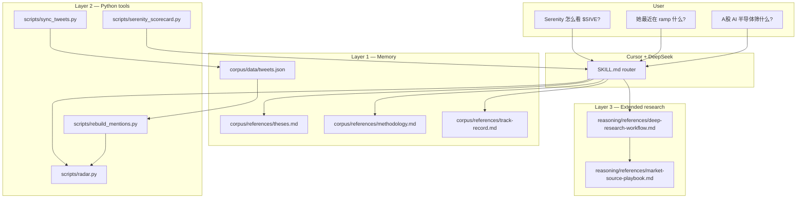

# Architecture

## Design goal

Build a **Serenity (@aleabitoreddit) digital twin** that:

1. Answers **“what does Serenity think about ticker X?”** from distilled corpus
2. Tracks **attention momentum** via mention analytics
3. Extends to **theme / A-share / fund screening** when needed
4. Optionally syncs new tweets when `X_BEARER_TOKEN` is configured

The LLM (e.g. DeepSeek in Cursor) provides reasoning. This repo provides **memory (corpus)**, **workflows (SKILL.md)**, and **deterministic tools (Python scripts)**.

## Layers



## Query modes

| Mode | Trigger | Primary sources | Scripts |
|------|---------|-----------------|---------|
| Ticker view | `$TICKER`, “Serenity 怎么看” | `theses.md`, `articles.md`, `track-record.md` | optional `radar.py` |
| Radar | “最近在 ramp”, “attention” | `mentions-events.csv` | `rebuild_mentions.py`, `radar.py` |
| Theme scan | 产业链, A-share, ETF | `deep-research-workflow.md`, `methodology.md` | `serenity_scorecard.py` |

## Data flow (optional live sync)

```text
X API (optional)
    │
    ▼
sync_tweets.py ──merge──► corpus/data/tweets.json
    │
    ▼
rebuild_mentions.py ──► mentions-events.csv, mentions-summary.csv
    │
    ▼
radar.py ──► Heating / New entrants / Conviction / Theme rotation
    │
    ▼
Agent + MAINTENANCE.md ──► update theses.md, track-record.md (manual/agent-assisted)
```

Without `X_BEARER_TOKEN`, steps above use the **bundled archive only**. Scripts exit with `status: disabled` and do not fail.

## Provenance

Corpus distilled from three open-source Serenity skill projects:

| Source | Contribution |
|--------|--------------|
| [yan-labs/serenity-aleabitoreddit](https://github.com/yan-labs/serenity-aleabitoreddit) | Tweet archive, theses, methodology, track-record, maintenance |
| [lanfuli/aleabito-serenity-skills](https://github.com/lanfuli/aleabito-serenity-skills) | Radar patterns, method framework, exemplars |
| [muxuuu/serenity-skill](https://github.com/muxuuu/serenity-skill) | A-share/HK workflow, scorecard, evidence ladder |

Unified into one Python codebase (`serenity_twin/` + `scripts/`).

## Non-goals

- Not a trading bot or signal feed
- Not affiliated with @aleabitoreddit
- Does not auto-rewrite theses on every tweet (distillation requires maintenance rules)
- Does not embed an LLM API client
